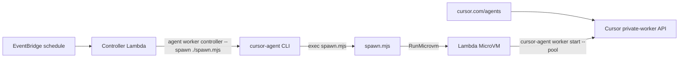

# Cursor pool workers on AWS Lambda MicroVMs

A CloudFormation stack that runs Cursor self-hosted pool workers inside [Lambda MicroVMs](https://docs.aws.amazon.com/lambda/latest/dg/lambda-microvms-guide.html).

The user-facing entrypoint is **applying this repo's CloudFormation template**. After the stack is up, start an agent from [cursor.com/agents](https://cursor.com/agents) against the pool. Do not run the CLI on your laptop.

## How it fits



Same shape as the Cloudflare Worker: scheduled compute runs the shared controller, which wakes a worker VM.

1. EventBridge invokes the Lambda.
2. The Lambda execs `agent worker controller --spawn ./spawn.mjs` (or `cursor-agent worker controller --spawn ./spawn.mjs`). That CLI is the controller — this repo does not poll or claim on its own.
3. `spawn.mjs` calls **RunMicrovm** with the CLI's `CURSOR_*` env and returns. It does not wait for the agent session.
4. The MicroVM entrypoint clones a repo if needed and execs `cursor-agent worker start --pool`. Agent idle-release and the MicroVM maximum duration tear the VM down.

If the CLI is a long-running loop, Lambda timeout ends the process and EventBridge starts another. If the CLI grows a one-tick flag, set stack parameter `WorkerControllerArgs` (for example `--once`).

## Apply the stack

Store the API key in SSM (not a plaintext stack parameter):

```bash
aws ssm put-parameter --type SecureString \
  --name /cursor-lambda-workers/cursor-api-key \
  --value "YOUR_SERVICE_ACCOUNT_KEY"
```

Build the Lambda image (Node wrapper + bundled `spawn.mjs` + published `agent` CLI) and deploy `cloudformation.yaml`:

```bash
npm ci
npm test
./scripts/deploy.sh
```

`deploy.sh` bundles, pushes `controller/Dockerfile` to ECR, and runs `aws cloudformation deploy` with `ControllerImageUri`. Equivalent manual steps:

```bash
IMAGE="$(./scripts/build-controller.sh)"
aws cloudformation deploy \
  --template-file cloudformation.yaml \
  --stack-name cursor-lambda-workers \
  --capabilities CAPABILITY_NAMED_IAM \
  --parameter-overrides \
    ControllerImageUri="${IMAGE}" \
    PoolName=default \
    PollIntervalMinutes=1 \
    CursorApiKeyParamName=/cursor-lambda-workers/cursor-api-key \
    MicroVmImageIdentifier=cursor-pool-worker
```

`create-stack` with the same template also works.

## Build the MicroVM image

Use a published image id, or build from this repo after the stack exists:

```bash
./scripts/build-image.sh cursor-lambda-workers
```

Watch `/aws/lambda/microvms/cursor-pool-worker` until the version is `SUCCESSFUL`. Set `MicroVmImageIdentifier` to that image name or ARN if it is not already the default.

The image `ENTRYPOINT` is `entrypoint.sh`, which clones if `REPO_URL` is set and execs `cursor-agent worker start --pool`. There is no hook HTTP server. Do not bake API keys or unique worker IDs into the snapshot; the guest reads the Cursor key from SSM at start.

## After deploy

Start an agent from [cursor.com/agents](https://cursor.com/agents) against the pool you passed as `PoolName`. The scheduled Lambda runs `agent worker controller --spawn ./spawn.mjs`, which launches a MicroVM.

## Prerequisites

- A Cursor team plan with self-hosted pool workers and a **service-account API key**
- Lambda MicroVMs in the target region (ARM64)
- Docker (linux/arm64) to build the controller Lambda image
- AWS CLI v2 with the `lambda-microvms` model

## Development

```bash
npm ci
npm test          # spawn.mjs (mocked RunMicrovm) + Lambda wrapper (mocked CLI exec)
npm run typecheck
npm run bundle
./scripts/validate-template.sh
```

## Limitations

- This repo does not implement pending-request polling, claim, matching, or a warm pool. The published `agent worker controller` does.
- Released `cursor-agent` wants `--worker-dir` to be a git clone. `spawn.mjs` requires a repo URL (or owner/name) from the CLI; the image can also clone `REPO_URL` or `git init` a workspace.
- MicroVMs are ARM64 with an 8 hour max lifetime.
- `@aws-sdk/client-lambda-microvms` may lag the service model; spawn signs `lambda-microvms` requests directly.
