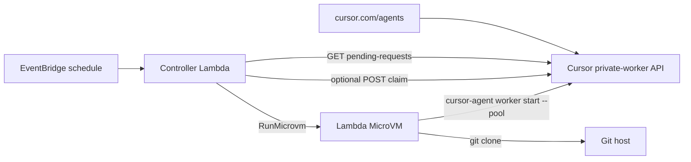

# Cursor pool workers on AWS Lambda MicroVMs

A CloudFormation stack that runs Cursor self-hosted pool workers inside [Lambda MicroVMs](https://docs.aws.amazon.com/lambda/latest/dg/lambda-microvms-guide.html).

The user-facing entrypoint is **applying this repo's CloudFormation template**. After the stack is up, start an agent from [cursor.com/agents](https://cursor.com/agents) against the pool. There is no local Node CLI to run.

## How it fits



Same shape as the Cloudflare worker: a scheduled controller polls pending requests and wakes compute. Here the controller is a Lambda; the workers are MicroVMs.

1. EventBridge invokes the controller Lambda.
2. The controller reads the Cursor service-account key from SSM, `GET /v0/private-workers/pending-requests` (Bearer, paginated), optionally `POST /v0/private-workers/claim` (404/405/501 still spawn), and applies concurrency plus an in-process spawn lease.
3. Each spawn is `RunMicrovm` with pool, repo, and key. The call returns as soon as the VM is submitted.
4. The MicroVM clones the repo and execs `cursor-agent worker start --pool`. Agent idle-release and the MicroVM maximum duration tear the VM down.

## Apply the stack

Store the API key in SSM (CloudFormation will not take it as a plaintext parameter):

```bash
aws ssm put-parameter --type SecureString \
  --name /cursor-lambda-workers/cursor-api-key \
  --value "YOUR_SERVICE_ACCOUNT_KEY"
```

Bundle the controller and deploy `cloudformation.yaml`:

```bash
npm ci
npm test
npm run bundle

ACCOUNT="$(aws sts get-caller-identity --query Account --output text)"
REGION="${AWS_REGION:-$(aws configure get region)}"
BUCKET="cursor-lambda-workers-cfn-${ACCOUNT}-${REGION}"
aws s3 mb "s3://${BUCKET}" 2>/dev/null || true

aws cloudformation package \
  --template-file cloudformation.yaml \
  --s3-bucket "${BUCKET}" \
  --output-template-file packaged.yaml

aws cloudformation deploy \
  --template-file packaged.yaml \
  --stack-name cursor-lambda-workers \
  --capabilities CAPABILITY_NAMED_IAM \
  --parameter-overrides \
    PoolName=default \
    Concurrency=3 \
    PollIntervalMinutes=1 \
    CursorApiKeyParamName=/cursor-lambda-workers/cursor-api-key \
    MicroVmImageIdentifier=cursor-pool-worker
```

Or `./scripts/deploy.sh` (same steps). `create-stack` with the packaged template also works.

Parameters that matter: **Cursor API key SSM name**, **pool name**, **concurrency**, **poll interval**, **MicroVM image id**.

## Build the MicroVM image

Use a published image id, or build from this repo after the stack exists (the artifact bucket and build role come from the stack):

```bash
./scripts/build-image.sh cursor-lambda-workers
```

Watch `/aws/lambda/microvms/cursor-pool-worker` until the image version is `SUCCESSFUL`. Set `MicroVmImageIdentifier` to that image name or ARN if it is not already the default.

Lambda MicroVMs snapshot `ENTRYPOINT` and inject per-run pool/repo/key only through the `/run` hook, so the image includes a small listener that starts `entrypoint.sh`. That script clones the repo and execs `cursor-agent worker start --pool`. Do not bake API keys or unique worker IDs into the snapshot.

## After deploy

Start an agent from [cursor.com/agents](https://cursor.com/agents) against the pool you passed as `PoolName`. The scheduled Lambda picks up the pending request and launches a MicroVM.

## Prerequisites

- A Cursor team plan with self-hosted pool workers and a **service-account API key**
- Lambda MicroVMs in the target region (ARM64)
- AWS CLI v2 with the `lambda-microvms` model

## Development

```bash
npm ci
npm test          # mocked fetch + mocked RunMicrovm
npm run typecheck
npm run bundle
./scripts/validate-template.sh
```

## Limitations

- One pool per stack (`PoolName`). No repo matching planner, warm floor, or DynamoDB slot table.
- Overlapping ticks on a cold start can double-spawn; claim-on-connect in the Cursor backend is authoritative. Warm invocations use the in-process lease.
- Released `cursor-agent` needs `--worker-dir` to be a git clone, so a pending request needs a repo URL (or owner/name).
- MicroVMs are ARM64 with an 8 hour max lifetime.
- `@aws-sdk/client-lambda-microvms` may lag the service model; the controller signs `lambda-microvms` requests directly.
