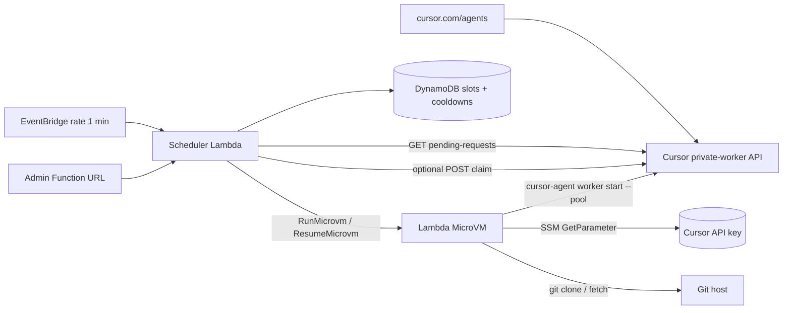

# Cursor self-hosted pool workers on AWS Lambda MicroVMs

A deployable template that a customer stands up in their own AWS account so [Cursor cloud agents](https://cursor.com/agents) run inside [Lambda MicroVMs](https://docs.aws.amazon.com/lambda/latest/dg/lambda-microvms-guide.html) they control.

This is the AWS sibling of the Cloudflare Containers reference. The planner (pool matching, serve / broadcast / warm modes, launch cooldowns, Cursor pending-request client) is TypeScript and platform-free. The AWS pieces are an EventBridge-scheduled scheduler Lambda, DynamoDB slot state, and a MicroVM image that runs `cursor-agent` as a **long-lived outbound bridge**.

This is **not** a classic 15-minute Lambda function. The worker daemon cannot live in a normal Lambda handler.

## Architecture



1. Someone starts a self-hosted cloud agent (dashboard, API, or Slack). Cursor queues a **pending request**. There is no pending-request webhook; the subscribe API was deferred. This template **polls**.
2. EventBridge invokes the scheduler about once a minute. The scheduler pages `GET /v0/private-workers/pending-requests`, matches requests to configured pools, and either **resumes** a suspended MicroVM or calls **RunMicrovm**.
3. The MicroVM `/run` (or `/resume`) hook fetches the Cursor service-account key from SSM by **parameter name**, clones or refreshes the pool repos, and starts `cursor-agent worker start --pool`. The worker opens an outbound HTTPS bridge to `api2.cursor.sh`.
4. Cursor assigns the session to the connected worker. Optional `POST /v0/private-workers/claim` is probed and used when live; the backend claim on connect remains authoritative.

## Prerequisites

- A Cursor team plan with self-hosted pool workers enabled, plus a **service-account API key** (not a personal user key).
- An AWS account with Lambda MicroVMs available (today: `us-east-1`, `us-east-2`, `us-west-2`, `eu-west-1`, `ap-northeast-1` — confirm in the current AWS docs). ARM64 only.
- [AWS SAM CLI](https://docs.aws.amazon.com/serverless-application-model/latest/developerguide/install-sam-cli.html) and AWS CLI v2 with the `lambda-microvms` model (`aws lambda-microvms help` should work).
- `zip` locally, used by `scripts/build-image.sh`.
- Repositories the pool should serve, and a git HTTPS token if they are private.

## Project layout

```
src/                 # Scheduler + platform-free planner (TypeScript)
  matching.ts        # Cloudflare planner: serve / broadcast / warm (no AWS imports)
  config.ts          # POOLS JSON + knobs (no AWS imports)
  types.ts           # Cloudflare planner types
  cursor-api.ts      # Bearer auth, pending-requests, listWorkers/listPools, optional claim
  launch-spec.ts     # RunMicrovm payload builder
  slot-state.ts      # in-memory slot store used by DynamoDB + tests
  scheduler.ts
  index.ts           # Lambda handler: EventBridge + /health /status /tick
microvm-image/       # Zipped into the MicroVM snapshot
  Dockerfile         # public.ecr.aws/lambda/microvms:al2023-minimal
  hooks.mjs          # /ready /run /resume /suspend /terminate
  entrypoint.sh      # restore-or-clone + cursor-agent
template.yaml        # SAM: scheduler, EventBridge, DynamoDB, IAM, S3
scripts/build-image.sh
test/                # vitest
```

## Pool config

Same knobs as the Cloudflare `wrangler.jsonc` vars:

| Name | Default | Meaning |
| --- | --- | --- |
| `POOLS` | `[{ name, repos, maxWorkers?, minWorkers? }]` | Pools this account will serve |
| `MAX_WORKERS_PER_POOL` | `3` | Cap unless a pool overrides `maxWorkers` |
| `MIN_WORKERS_PER_POOL` | `1` | Warm floor unless a pool overrides `minWorkers` |
| `WORKER_IDLE_RELEASE_TIMEOUT_SECONDS` | `300` | Passed to `cursor-agent --idle-release-timeout` |
| `POLL_INTERVAL_SECONDS` | `20` (Cloudflare) / EventBridge `1 minute` | Planner interval. EventBridge `rate()` cannot go below 1 minute |
| `CURSOR_API_URL` | `https://api.cursor.com` | Fleet-management API |
| `CURSOR_AGENT_ENDPOINT` | `https://api2.cursor.sh` | Worker bridge |

Example `POOLS`:

```json
[
  {
    "name": "default",
    "repos": ["https://github.com/your-org/your-repo"],
    "maxWorkers": 3,
    "minWorkers": 1
  }
]
```

### Launch modes

Same planner as the Cloudflare reference (`src/matching.ts`):

- **serve** — oldest matching pending request wins a free `pool=<name>/slot=<n>`. Missing `pool` label targets pool `default`. Repo identity is `repoKeyFromUrl` / `repoKeyFromOwnerName` (lowercase owner/name, GitLab nested groups, ssh/https/git@). A request with no resolvable repo never matches. Any-repo pools still require `request.repoUrl`. Serve clones the pool's **full** `repos` list when configured, else `[request.repoUrl]`.
- **broadcast** — one-off register boot (`pool=<name>/broadcast`) when `poolConfigFingerprint` changes, so durable pool rows appear in the composer picker. Not leftover demand after serve.
- **warm** — fill `minWorkers` only on pools that already have clone URLs. Slots reserved by serve this tick are skipped. A live **or suspended** MicroVM counts as `running` toward the floor.

Per-slot and per-request cooldown is 120s (`LAUNCH_COOLDOWN_MS`). Request records expire after 15 minutes. There is no per-pool "one launch per window" lock. Worker display names use an `aws-` prefix.

### CLI limitation (same as Cloudflare)

Released `cursor-agent` requires each `--worker-dir` to be a **git clone**. Requests without a resolvable repo never match. Warm and broadcast require the pool to list clone URLs.

## Secrets

Store the Cursor service-account API key as an SSM **SecureString**. CloudFormation cannot create SecureString parameters.

```bash
aws ssm put-parameter --type SecureString \
  --name /cursor-lambda-workers/cursor-api-key \
  --value "YOUR_SERVICE_ACCOUNT_KEY"

# Optional, for private git hosts:
aws ssm put-parameter --type SecureString \
  --name /cursor-lambda-workers/git-token \
  --value "YOUR_GIT_HTTPS_TOKEN"
```

**Credential boundary**

- The raw key is never in SAM parameters, Lambda environment variables, the MicroVM snapshot, or `runHookPayload`.
- The scheduler receives only the **parameter name**. It reads the key at runtime so it can poll `pending-requests` (Cursor has no webhook). That is the one intentional difference from the Claude MicroVM sample, whose launcher never calls the vendor API.
- The MicroVM execution role also `GetParameter`s the key (and optional git token) on `/run` and `/resume`. Tokens expire if they are captured in a snapshot, so they are always fetched fresh.
- Git credentials use an in-memory `credential.helper` and are never written to disk.

**OIDC** is the next step: Cursor already supports OIDC for private workers. This prototype uses a service-account key so a customer can stand the stack up without waiting on an OIDC mapping. Do not block a first deploy on OIDC.

## Deploy

```bash
npm install
npm test
npm run typecheck

sam build
sam deploy --guided --capabilities CAPABILITY_NAMED_IAM \
  --parameter-overrides \
    Pools='[{"name":"default","repos":["https://github.com/your-org/your-repo"]}]' \
    AdminToken="$(openssl rand -hex 32)"
```

Create the SSM parameters (names are stack outputs), then build the MicroVM image:

```bash
./scripts/build-image.sh cursor-lambda-workers
```

The script zips `microvm-image/` (Dockerfile at the zip root), uploads to the artifact bucket, and calls `create-microvm-image` with lifecycle hooks enabled. Watch `/aws/lambda/microvms/cursor-pool-worker` until the version is `SUCCESSFUL`.

### Start an agent

1. Open [cursor.com/agents](https://cursor.com/agents).
2. Choose **Self-hosted** and the pool name you configured (`default` unless you set another).
3. Pick a repo that appears in `POOLS` (or start via the [Cloud Agents API](https://cursor.com/docs/cloud-agent/api/endpoints) with `env.type: "pool"`).
4. Within about one EventBridge interval the scheduler should `RunMicrovm`. Confirm with:

```bash
aws lambda-microvms list-microvms --image-identifier cursor-pool-worker
curl -sS "$ADMIN_URL/status" -H "Authorization: Bearer $ADMIN_TOKEN"
```

`GET /health` is unauthenticated. `/status` and `/tick` require `Authorization: Bearer <AdminToken>`.

## Idle, suspend, and lifetime

Two different clocks:

| Clock | What it measures | Default |
| --- | --- | --- |
| `cursor-agent --idle-release-timeout` | Session idle on the Cursor bridge | 300s |
| Lambda MicroVM `idlePolicy` | **Inbound proxy** traffic only | 8h / 8h retain |

AWS idle is *not* “the agent is waiting for work”. An outbound-only bridge looks idle to the platform even while connected. Auto-suspend at 5 minutes of inbound silence would flap the warm floor on every EventBridge tick.

This template therefore:

- Passes `maximumDurationInSeconds = 28800` (8 hours), matching the Cloudflare max run lifetime.
- Sets MicroVM `idlePolicy` to retain suspended state up to 8 hours with `autoResumeEnabled: true`, but uses a **high inbound idle threshold** so warm workers are not suspended just because nothing called their HTTPS endpoint.
- Treats `WORKER_IDLE_RELEASE_TIMEOUT_SECONDS` (300) as the real idle signal. After the agent exits, `/suspend` stops the process; the scheduler **resumes** a free suspended slot before launching a new MicroVM when that is useful.
- Snapshot boot is the primary repo cache. An optional S3 tarball (`s3://$bucket/repo-cache/<repo>.tar`) is only a fallback for large repos that change independently of the image.

To attach a customer VPC, create a [Lambda Network Connector](https://docs.aws.amazon.com/lambda/latest/dg/lambda-microvms-guide.html) and pass `ExtraEgressConnectorArn` / `ExtraIngressConnectorArn`. Internet egress is on by default so `cursor-agent` can reach `api2.cursor.sh`. VPC-only customers must allowlist Cursor and git egress themselves.

## Comparison with the Cloudflare reference

| | Cloudflare Containers | This template |
| --- | --- | --- |
| Trigger | Durable Object alarm (~20s) | EventBridge `rate(1 minute)` + optional `/tick` |
| Worker runtime | Container running `cursor-agent` | Lambda MicroVM running `cursor-agent` |
| Slot / cooldown state | Durable Object | DynamoDB |
| Repo cache | R2 tarball | MicroVM snapshot; optional S3 tarball |
| Secrets | Wrangler secrets | SSM SecureString, passed by **name** |
| Claim | Backend claims when the worker connects; optional `POST /claim` | Same |
| Max lifetime | 8 hours | `maximumDurationInSeconds = 28800` |

EventBridge cannot schedule every 20 seconds. Invoke `POST /tick` from a tighter loop if you need Cloudflare-like cadence.

## Limitations

- Poll-only. Do not invent a webhook; Cursor has not shipped pending-request push.
- Snapshot uniqueness: worker names, IDs, and secrets are created on `/run` and refreshed on `/resume`. Rebuilding the image does not mint per-tenant identity.
- Released `cursor-agent` cannot serve a repo-less `--worker-dir`.
- MicroVMs are ARM64, 8 hour max, regional preview availability.
- The scheduler must read the API key to poll. Moving that to OIDC is the follow-up, not a deploy blocker.
- `@aws-sdk/client-lambda-microvms` may lag the service model; the scheduler signs `lambda-microvms` requests directly.

## Development

```bash
npm install
npm test          # vitest: matching, config, launch-spec, slot-state, cursor-api
npm run typecheck
./scripts/validate-template.sh
```

`src/matching.ts`, `src/types.ts`, `src/config.ts`, and `src/cursor-api.ts` must stay free of AWS imports so the planner tests run without credentials.

## Security notes

- Do not commit `.env`, `samconfig.toml`, or parameter values that contain keys.
- The Function URL is unauthenticated at API Gateway; `/status` and `/tick` check `ADMIN_TOKEN` in-process. Restrict the URL at the edge if you expose it beyond operators.
- Artifact bucket: public access blocked, SSE-S3, versioning on.
- Each MicroVM is an isolated Firecracker VM. Sessions do not share memory with each other.
