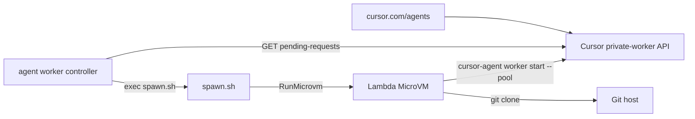

# Cursor pool workers on AWS Lambda MicroVMs

A customer-owned **spawn script** and **MicroVM image** so [Cursor cloud agents](https://cursor.com/agents) run inside [Lambda MicroVMs](https://docs.aws.amazon.com/lambda/latest/dg/lambda-microvms-guide.html).

Matching and polling live in the Cursor agent CLI (`agent worker controller`). This repo only starts a MicroVM when that command execs `spawn.sh`.

## How it fits



1. Install the Cursor agent CLI and run `agent worker controller --spawn ./spawn.sh`.
2. The controller decides when a worker is needed and execs the script with `CURSOR_*` env vars.
3. `spawn.sh` calls **RunMicrovm** with a one-shot worker identity (`CURSOR_WORKER_NAME`) and **exits**. It does not wait for `cursor-agent`.
4. The MicroVM `/run` hook clones the request repo and starts `cursor-agent worker start --pool`. Idle-release on the agent exits the process; the hook then terminates the MicroVM.

## Run the controller

After `npm install` and `sam deploy` (below):

```bash
export AWS_REGION=us-east-1
export MICROVM_IMAGE_IDENTIFIER="arn:aws:lambda:us-east-1:ACCOUNT:microvm-image:cursor-pool-worker"
export MICROVM_EXECUTION_ROLE_ARN="arn:aws:iam::ACCOUNT:role/cursor-lambda-workers-microvm-execution-role"
# optional: MicroVM reads the key from SSM instead of the run-hook payload
export CURSOR_API_KEY_PARAM_NAME=/cursor-lambda-workers/cursor-api-key

agent worker controller --spawn ./spawn.sh
# equivalent:
# cursor-agent worker controller --spawn ./spawn.sh
```

`spawn.sh` uses `tsx` (via local `node_modules/.bin` or `npx`) to run `src/spawn.ts`.

### Env the controller sets

`spawn.sh` reads these and returns immediately:

| Variable | Required | Meaning |
| --- | --- | --- |
| `CURSOR_WORKER_NAME` | yes | One-shot worker identity passed into the MicroVM |
| `CURSOR_API_KEY` | yes | Service-account key (used in the run hook unless an SSM param name is set) |
| `CURSOR_REPO_URL` | yes* | Clone URL. *Or* `CURSOR_REPO_OWNER` + `CURSOR_REPO_NAME` |
| `CURSOR_POOL` | no | Pool name (default `default`) |
| `CURSOR_REQUEST_ID` | no | Pending request id |
| `CURSOR_USER_EMAIL` | no | Passed through to the run hook |
| `CURSOR_REPO_OWNER` / `CURSOR_REPO_NAME` | no | Used to build a GitHub HTTPS URL when `CURSOR_REPO_URL` is absent |

### Env you set for AWS

| Variable | Required | Meaning |
| --- | --- | --- |
| `MICROVM_IMAGE_IDENTIFIER` | yes | MicroVM image name or ARN |
| `MICROVM_EXECUTION_ROLE_ARN` | yes | Role the MicroVM assumes |
| `AWS_REGION` | no | Default `us-east-1` |
| `CURSOR_API_KEY_PARAM_NAME` | no | If set, the MicroVM fetches the key from SSM and the raw key is not put in `runHookPayload` |
| `GIT_TOKEN_PARAM_NAME` | no | Optional SSM git HTTPS token |
| `WORKER_IDLE_RELEASE_TIMEOUT_SECONDS` | no | Passed to `cursor-agent` (default 300) |
| `CURSOR_API_URL` / `CURSOR_AGENT_ENDPOINT` | no | Fleet API / worker bridge |
| `REPO_CACHE_BUCKET` | no | Optional S3 tarball cache |
| `MICROVM_LOG_GROUP` | no | CloudWatch group for the MicroVM |

Exit codes from `spawn.sh`: **0** submitted, **1** retryable (network / 5xx / 429), **2+** non-retryable (missing env / 4xx).

## Deploy IAM and the artifact bucket

```bash
npm install
npm test
npm run typecheck
sam build
sam deploy --guided --capabilities CAPABILITY_NAMED_IAM
```

The stack creates:

- **SpawnRole** — `lambda:RunMicroVm`, `iam:PassRole` on the execution role, `lambda:PassNetworkConnector` (internet egress + all ingress by default)
- **MicroVmExecutionRole** — SSM `GetParameter` for the Cursor key (and optional git token), self `TerminateMicrovm`, logs
- **ArtifactBucket** + **BuildRole** — for `scripts/build-image.sh`

It does **not** create a scheduler Lambda, EventBridge rule, or DynamoDB table.

Assume SpawnRole (or attach the same permissions to the identity that runs `agent worker controller`):

```bash
aws sts assume-role --role-arn "$SPAWN_ROLE_ARN" --role-session-name cursor-spawn
```

Optional SSM parameters (CloudFormation cannot create SecureString values):

```bash
aws ssm put-parameter --type SecureString \
  --name /cursor-lambda-workers/cursor-api-key \
  --value "YOUR_SERVICE_ACCOUNT_KEY"
```

## Build the MicroVM image

```bash
./scripts/build-image.sh cursor-lambda-workers
```

The script zips `microvm-image/` (Dockerfile at the zip root), uploads it to the artifact bucket, and calls `create-microvm-image` with lifecycle hooks enabled. Watch `/aws/lambda/microvms/cursor-pool-worker` until the version is `SUCCESSFUL`.

Set `MICROVM_IMAGE_IDENTIFIER` to that image name or ARN before running `agent worker controller --spawn ./spawn.sh`.

### Image contents

- Base: `public.ecr.aws/lambda/microvms:al2023-minimal`
- `git` + `cursor-agent` at image build
- Hook server (`/ready`, `/run`, `/resume`, `/suspend`, `/terminate`)
- `/run` mints identity from `CURSOR_WORKER_NAME`, fetches secrets if only an SSM name was supplied, clones the repo, and starts `cursor-agent worker start --pool`
- When the agent exits (idle-release), the hook terminates the MicroVM

Do not bake API keys, git tokens, or unique worker IDs into the snapshot.

## Prerequisites

- A Cursor team plan with self-hosted pool workers and a **service-account API key**
- Lambda MicroVMs in the target region (ARM64)
- [AWS SAM CLI](https://docs.aws.amazon.com/serverless-application-model/latest/developerguide/install-sam-cli.html) and AWS CLI v2 with the `lambda-microvms` model
- The Cursor agent CLI (`agent` or `cursor-agent`) with `worker controller`

## Development

```bash
npm install
npm test          # vitest: spawn client with a mocked RunMicrovm
npm run typecheck
./scripts/validate-template.sh
```

## Limitations

- This repo does not poll Cursor or plan capacity. Run `agent worker controller --spawn ./spawn.sh`.
- Released `cursor-agent` needs `--worker-dir` to be a git clone. The spawn client requires a repo URL (or owner/name).
- MicroVMs are ARM64 with an 8 hour max lifetime.
- `@aws-sdk/client-lambda-microvms` may lag the service model; spawn signs `lambda-microvms` requests directly.
